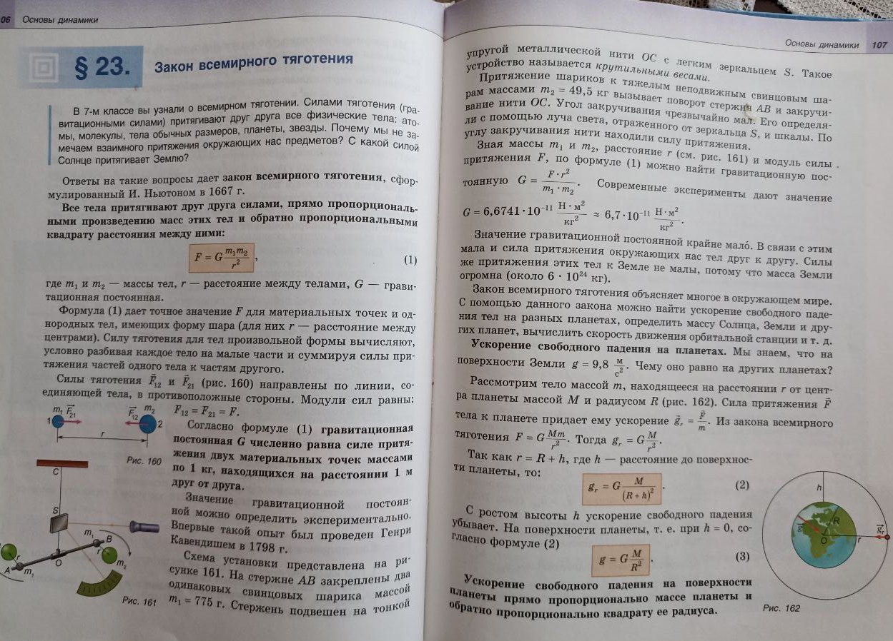

= Физика 9 класс

Физика 9 класс, 2019, Исаченкова Л.А. Сокольский А.А Захаревич Е.В 

== $23 Закон всемирного тяготения

* Неполное описание установки для определения гравитационной постоянной.
Не упомянуты дополнительные свинцовые шары, хотя это неотъемлемая часть
установки (крутильные весы + шары).
На рисунке шары изображены, но словесное описание все равно должно быть
логически законченным.

* Логически незаконченное описание крутильных весов
    ** "По углу закручивания нити находили силу притяжения" - необходимо
    дополнить как по углу определяется сила или убрать фразу.
    ** Упоминание "легкого зеркальца" необходимо дополнить его назначением либо
    убрать фразу.

* Грубая ошибка в описании формулы вычисления гравитационной постоянной.
  Для вычисления постоянной, предлагается взять силу из той же самой формулы (1), где 
  используется искомая величина (G).

.Исходная формула 1 
----
F = G * (m1 * m2) / r^2
----

.Выражена G
----
G = F * r^2 / (m1 * m2)
----

На самом деле в качестве F неоходимо брать величину, полученную в результате
изменений (на крутильных весах).

